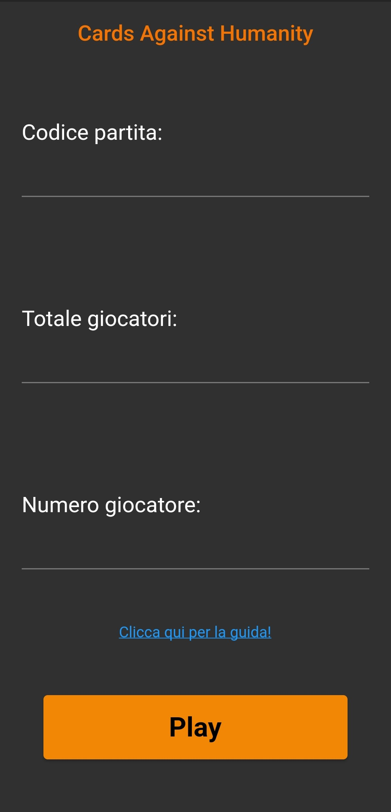
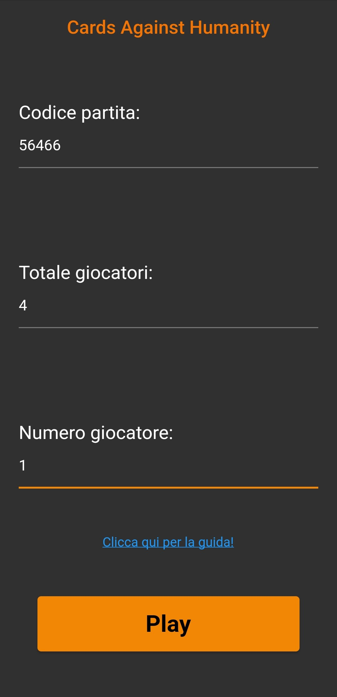
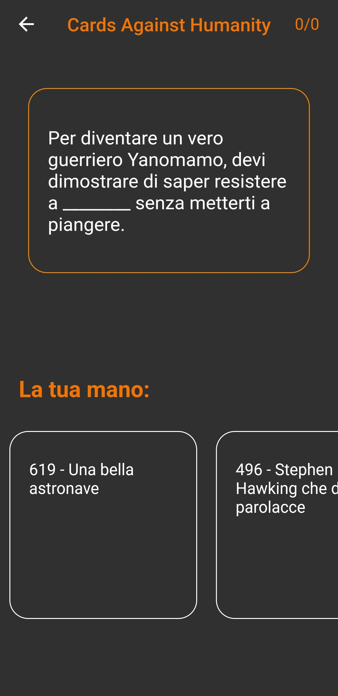
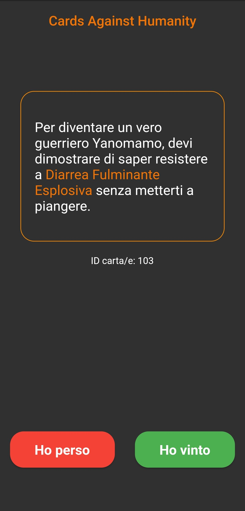
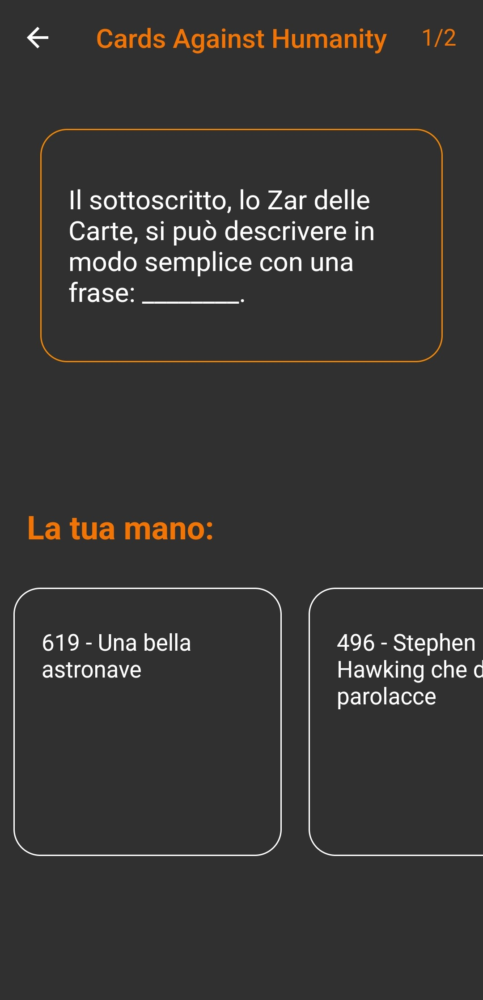
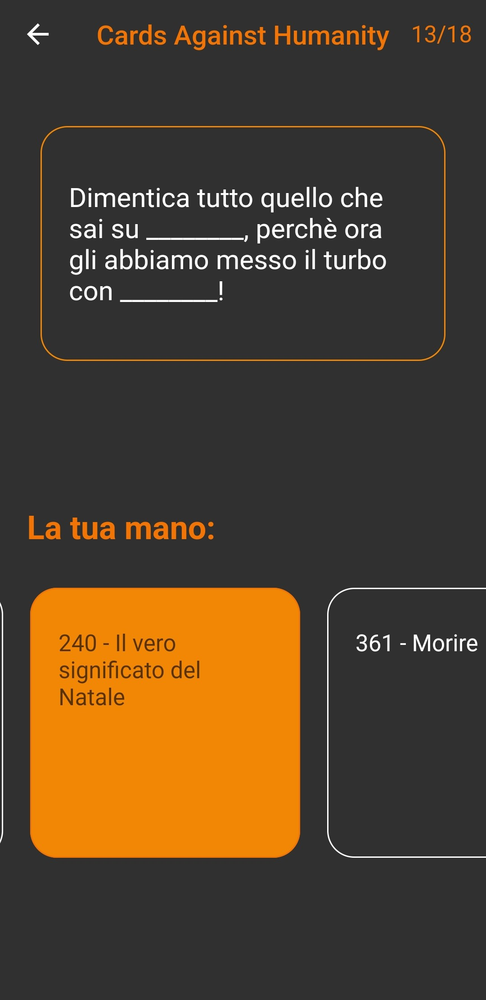
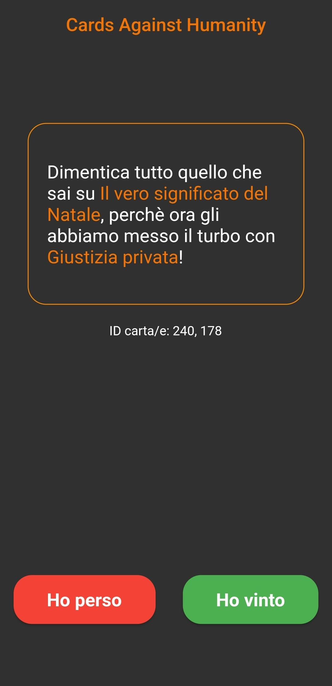
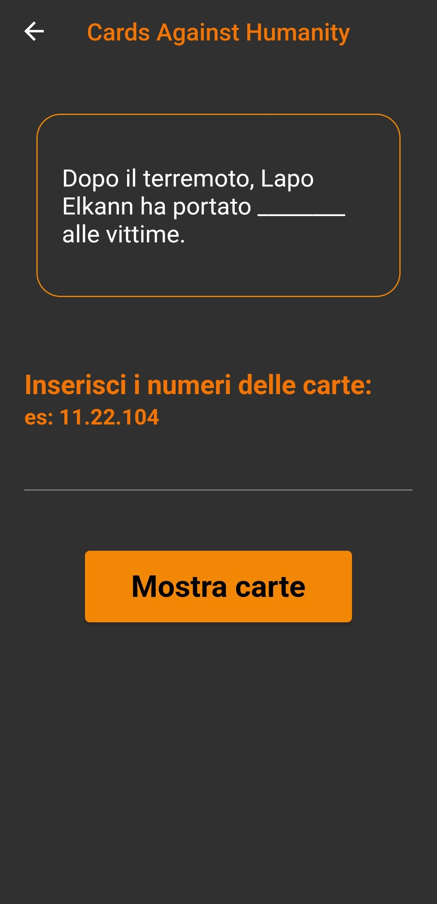
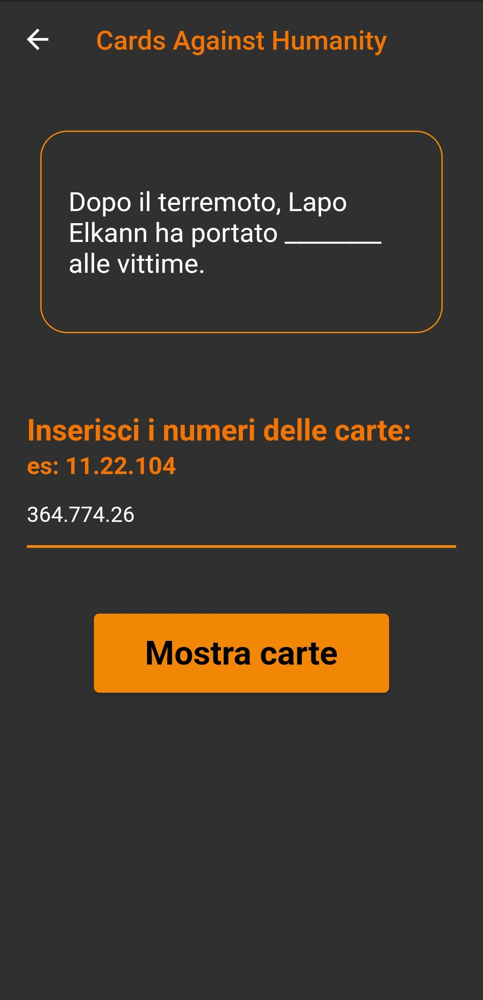
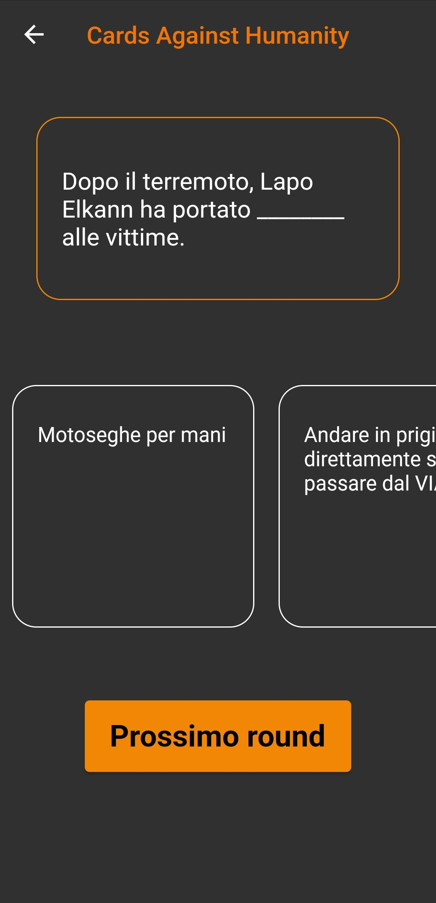

# Cards-Against-Humanity
Quest'app non così politicamente corretta può essere usata per giocare a ``Cards Against Humanity`` fino a 20 giocatori, **senza una connessiona Internet**.

## Informazioni sul funzionamento
Il gioco, basandosi su una semi-randomizzazione che utilizza un **seed** (il codice partita), per capirci come i mondi Minecraft, permette di randomizzare per tutti le stesse carte domananda e a tempo stesso diverse carte risposta. Perciò richiede che tutti i giocatori si trovino nello stesso posto (come nel gico vero, solo che questo è gratis).
In quest'app c'è anche un easteregg, buona fortuna a trovarlo.

### Auto-Update
L'applicazione risulterà sempre aggiornata alla versione corrente in quanto ad ogni avvio controllerà grazie alle API di GitHub qual'è l'ultima versione e in caso essa non corrisponda a quella corrente verrà chiesto all'utente il permesso di installare quella più recente. Come visibile dall'immagine nel banner per il consenso vengono mostrate il numero della nuova versione ed elencate ``Funzionalità``, ``Cambiamenti`` e se vi sono stati dei ``Bug fixies``. In aggiunta vi è anche un [link](https://github.com/ErosM04/Cards-Against-Humanity/releases/latest) all'ultimo release per visualizare nel dettaglio tutti i cambiamenti.

    

## Come giocare

### Inizio
Appena avviato il gioco ci troveremo davanti ad una schermata in cui vanno inseriti tre dati:
- il seed o codice partita, un numero a caso (o a piacere) che deve essere uguale per tutti i giocatori.
- il totale dei giocatori, **da 3 a 20**.
- il numero del giocatore, da 1 fino al totale di giocatori.
In aggiunta vi sarà anche un [link](https://github.com/ErosM04/Cards-Against-Humanity) che indirizza alla repo GitHub del progetto così da avere un facile accesso alle istruzioni.

    

Di seguito un esempio di come inserire i dati per una partita. In questo caso ``56466`` è il seed che tutti dovrano inserire uguale. Poi il numero totale di giocatori, in questo caso ``4``. Ed infine il numero del giocatore, che in questo caso può andare da 1 a 4, l'importante è che ogn'uno abbia un numero diverso.

    

### Player turn
Nel caso in cui **non** avessimo iniziato come giocatore **1** ci troveremmo davanti ad una schermata simile a questa, giocheremmo quindi un turno normale da giocatore.

Nella schermata potremmo vedere al centro la carta domanda con uno spazio vuoto da completare indicato da ``_____``. Per colmare quel buco con qualche cazzata ci basterà cliccare una delle carte dal carosello sottostante che rappresenta la nostra mano di **10** carte.
Inoltre nella barra in alto vi è a sinistra un icon per terminare la partita e a destra il nostro attuale punteggio, attualmente 0/0 poiché non abbiamo ancora giocato niente.

    

Una volta cliccata la carta scelta verremo indirizzati in una seconda schermata in cui è presente la carta domanda, completata con la risposta da noi scelta. Oltre a questo vi sarà anche un numero che non è altro che l'id della carta, che servirà al giocatore che sta giocando il **Master turn**.

In fondo alla pagine vi sono due bottoni con cui indicare se in quel turno si ha **vinto** o **perso**, l'obbietivo ovviamente è far ridere, dunque solo chi avrà fatto ridere con la cacata più simpatica potrà gudagnarsi il turno. Rispondete responsabilmente.

    

Una volta premuti i tasti della schermata precedente, a meno che non sia il nostro turno di giocare come Master, verremo riportati alla schermata di prima solo che ora i punti saranno cambiati, come la carta domanda. Inoltre la carta utilizzata sarà sostituita da un'altra carta, sempre per un massimo di 10.

    

    

    

### Master turn
In questo caso, avendo iniziato come giocatore **1**, inizieremo come master

    

    

    

